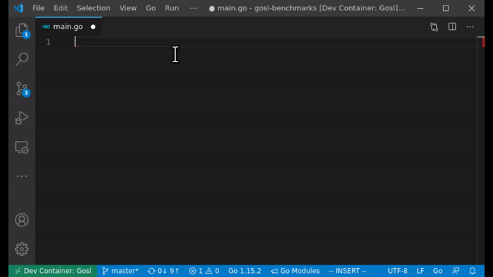

# Gosl &ndash; Go scientific library

Gosl is a set of tools for developing scientific simulations using the Go language. We mainly consider the development of numerical methods and solvers for differential equations but also present some functions for fast Fourier transforms, the generation of random numbers, probability distributions, and computational geometry.

This library contains essential functions for linear algebra computations (operations between all combinations of vectors and matrices, eigenvalues and eigenvectors, linear solvers) and the development of numerical methods (e.g. numerical quadrature).

We link Gosl with existent libraries written in C and Fortran, such as OpenBLAS, LAPACK, UMFPACK, MUMPS, QUADPACK and FFTW3. These existent libraries have been fundamental for the development of high-performant simulations over many years. We believe that it is nearly impossible to rewrite these libraries in native Go and at the same time achieve the same speed delivered by them. Just for reference, a naive implementation of matrix-matrix multiplication in Go is more than 100 times slower than OpenBLAS.

## Installation

Because of CGO and other libraries, the easiest way to work with Gosl is via Docker. Having Docker and VS Code installed, you can start developing powerful numerical simulations using Gosl in a matter of seconds. Furthermore, the best part of it is that it works on Windows, Linux, and macOS out of the box.

### Quick, containerized (recommended)

1. Install Docker
2. Install Visual Studio Code
3. Install the Remote Development extension for VS Code
4. Clone https://github.com/cpmech/hello-gosl
5. Create your own application within a container (see gif below)

Done. And your system will remain "clean."


Our [Docker Image](https://hub.docker.com/repository/docker/gosl/gosl) also contains Go and the Go Tools for working with VS Code (or not). Below is a video showing the convenience of VS Code + the Go tools + Gosl. Note how fast VS Code is in finding the function ReadLines and the package gosl/io even under a clash with go's own io package. Upon file save, the Go tools automatically add the required imports. Note also the very convenient auto-completion of the callback function given to ReadLines. Also, Code + the Go tools nicely fill the function arguments with default values.




### Debian/Ubuntu GNU Linux

Because we use CGO for linking Gosl with many libraries, we cannot use the so convenient _go get_ functionality for installing Gosl. Moreover, we view Gosl as the most basic set of libraries for high-performance computing and therefore prefer to install Gosl directly alongside Go. In other words, Gosl extends Go with powerful tools for scientific simulations.

Gosl is then linked to `WHEREVER_GO_IS_LOCATED/src/gosl`; e.g. `/usr/local/go/src/gosl`. We have experimented with GOPATH and the newer Go Modules approach, but both do not work well with CGO (and hence Gosl).

**Download and link Gosl**

Assuming that your go code is located in `$HOME/mygo` and that go has been installed in `$HOME/go`:

```
git clone https://github.com/cpmech/gosl.git $HOME/mygo/gosl
ln -s $HOME/mygo/gosl $HOME/go/src/gosl
```

**Install dependencies**

```
sudo apt-get install -y --no-install-recommends \
  gcc \
  gfortran \
  libopenmpi-dev \
  libhwloc-dev \
  liblapacke-dev \
  libopenblas-dev \
  libmetis-dev \
  libsuitesparse-dev \
  libmumps-dev \
  libfftw3-dev \
  libfftw3-mpi-dev
```

**Compile Gosl**

```
cd $HOME/mygo/gosl
bash ./all.bash
```

Done.

## Documentation

Gosl includes the following *essential* packages:

- [chk](https://github.com/cpmech/gosl/tree/master/chk). To check numerical results and for unit testing
- [io](https://github.com/cpmech/gosl/tree/master/io). Input/output including printing to the terminal and handling files
- [utl](https://github.com/cpmech/gosl/tree/master/utl). To generate series (e.g. linspace) and other functions as in pylab/matlab/octave

Gosl includes the following *main* packages:

- [fun](https://github.com/cpmech/gosl/tree/master/fun). Special functions, DFT, FFT, Bessel, elliptical integrals, orthogonal polynomials, interpolators
- [gm](https://github.com/cpmech/gosl/tree/master/gm). Geometry algorithms and structures
- [hb](https://github.com/cpmech/gosl/tree/master/hb). Pseudo hierarchical binary (hb) data file format
- [la](https://github.com/cpmech/gosl/tree/master/la). Linear Algebra: vector, matrix, efficient sparse solvers, eigenvalues, decompositions
- [mpi](https://github.com/cpmech/gosl/tree/master/mpi). Message Passing Interface for parallel computing
- [num](https://github.com/cpmech/gosl/tree/master/num). Fundamental numerical methods such as root solvers, non-linear solvers, numerical derivatives and quadrature
- [ode](https://github.com/cpmech/gosl/tree/master/ode). Solvers for ordinary differential equations
- [opt](https://github.com/cpmech/gosl/tree/master/opt). Numerical optimization: Interior Point, Conjugate Gradients, Powell, Grad Descent
- [pde](https://github.com/cpmech/gosl/tree/master/pde). Solvers for partial differential equations (FDM, Spectral, FEM)
- [rnd](https://github.com/cpmech/gosl/tree/master/rnd). Random numbers and probability distributions

(see each sub directory for more information)

## Examples

Pelase check out https://github.com/cpmech/gosl-examples

## Benchmarks

Pelase check out https://github.com/cpmech/gosl-benchmarks
