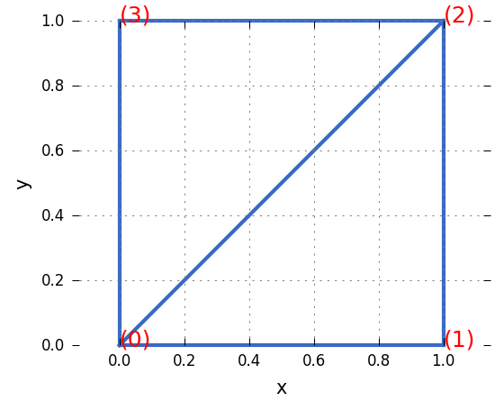

# Gosl. gm/tri. Mesh generation: triangles

The `tri` package has functions go generate meshes of triangular elements and Delaunay
triangulations. The package is a light wrapper to the very efficient `Triangle` code by Jonathan
Shewchuk and available at [the Triangle website](https://www.cs.cmu.edu/~quake/triangle.html).

Triangle's licence details are in the <a href="triangle_README.txt">triangle_README.txt</a> file.

In addition of being very fast, `Triangle` can generate meshes with great quality; i.e. it is a
**quality-mesh triangulator**.

Here, the Cartesian coordinates of points are stored in continuous 1D arrays (slices) such as:

```
X = { x0, x1, x2, ... Npoints }
Y = { y0, y1, y2, ... Npoints }
```

The topology is simply defined by two slices usually named `V` for vertices and `C` for cells
(triangles):

```
V = { { x0, y0 }, { x1, y1 }, { x2, y2 } ... Nvertices }
C = { { id0, id1, id2 }, { id0, id1, id2 } ... Ncellls }
```

where `V` is the list of vertices (there are Nvertices vertices) and `C` is the list of triangles
(there are Ncells triangles). The ids (e.g. id0, id1, id2) in `C` are the indices in `V`.

## Draw mesh



For example, the set of triangles in the above figure are defined (and drawn) with:

```go
// vertices (points)
V := [][]float64{
    {0, 0}, {1, 0},
    {1, 1}, {0, 1},
}

// cells (triangles)
C := [][]int{
    {0, 1, 2},
    {2, 3, 0},
}
```

Source code: <a href="../../examples/tri_draw01.go">../../examples/tri_draw01.go</a>

## Delaunay triangulation

The Delaunay triangulation of a cloud of points in the `tri` package is easily computed with the
`Delaunay` command that takes as input the Cartesian coordinates.

<div id="container">
<p></p>
</div>

Source code: <a href="../../examples/tri_delaunay01.go">../../examples/tri_delaunay01.go</a>

## API

**go doc**

```
package tri // import "gosl/gm/tri"

Package tri wraps Triangle to perform mesh generation a Delaunay
triangulation

FUNCTIONS

func Delaunay(X, Y []float64, verbose bool) (Verts [][]float64, Cells [][]int)
    Delaunay computes 2D Delaunay triangulation using Triangle

        Input:
          X = { x0, x1, x2, ... Npoints }
          Y = { y0, y1, y2, ... Npoints }
        Ouptut:
          Verts = { { x0, y0 }, { x1, y1 }, { x2, y2 } ... Nvertices }
          Cells = { { id0, id1, id2 }, { id0, id1, id2 } ... Ncellls }


TYPES

type Cell struct {
	ID       int   // identifier
	Tag      int   // tag
	V        []int // vertices
	EdgeTags []int // edge tags (2D or 3D)
}
    Cell holds cell data

type Hole struct {
	X float64 // x-coordinate of a point inside hole
	Y float64 // y-coordinate of a point inside hole
}
    Hole holds input data defining a "hole"

type Input struct {
	Points   []*Point   // list of points
	Segments []*Segment // list of segments
	Regions  []*Region  // list of regions
	Holes    []*Hole    // list of holes
}
    Input holds a Planar Straight Line Graph (PSLG)

func (o *Input) Generate(globalMaxArea, globalMinAngle float64, o2, verbose bool, extraSwitches string) (m *Mesh)
    Generate generates unstructured mesh of triangles

        globalMaxArea  -- imposes a maximum triangle area constraint; fixed area constraint that applies to every triangle
        globalMinAngle -- quality mesh generation with no angles smaller than specified value in degrees
                          globalMinAngle must be in [0, 60]
        o2             -- generates quadratic triangles
        verbose        -- shows Triangle messages
        extraSwitches  -- extra arguments to be passed to Triangle

type Mesh struct {
	Verts []*Vertex // vertices
	Cells []*Cell   // cells
}
    Mesh defines mesh data

type Point struct {
	Tag int     // tag
	X   float64 // x-coordinate
	Y   float64 // y-coordinate
}
    Point holds input data defining a "point"

type Region struct {
	Tag     int     // tag of region
	MaxArea float64 // max area constraint for triangulation of region
	X       float64 // x-coordinate of a point inside region
	Y       float64 // y-coordinate of a point inside region
}
    Region holds input data defining a "region"

type Segment struct {
	Tag int // tag
	L   int // left point
	R   int // right point
}
    Segment holds input data defining a "segment"

type Vertex struct {
	ID  int       // identifier
	Tag int       // tag
	X   []float64 // coordinates [2]
}
    Vertex holds vertex data

```
